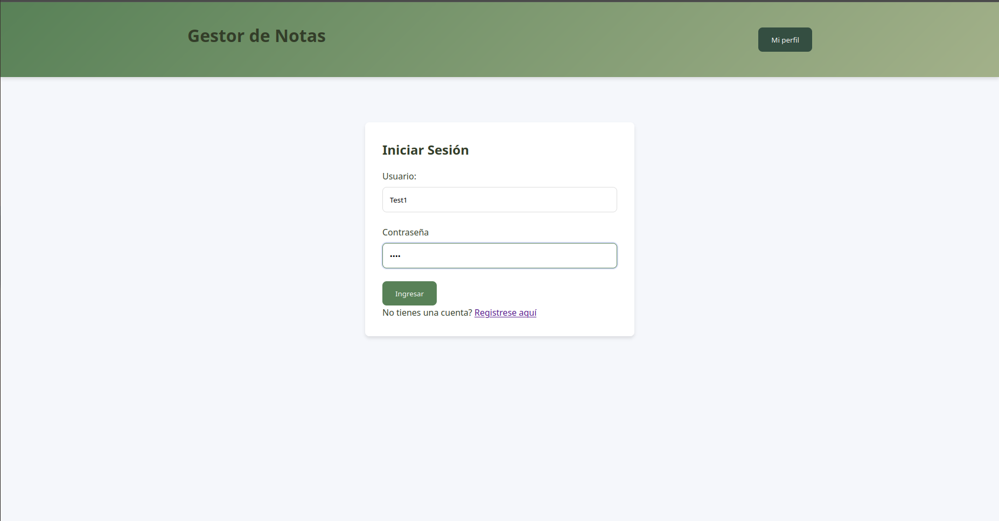
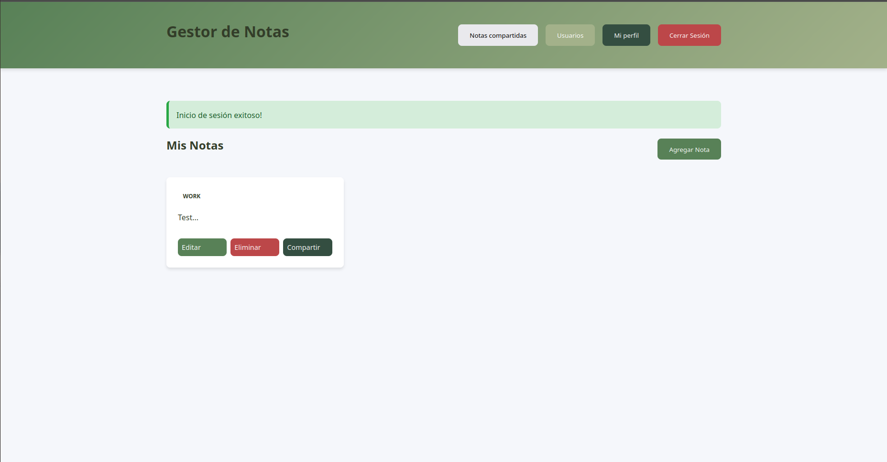
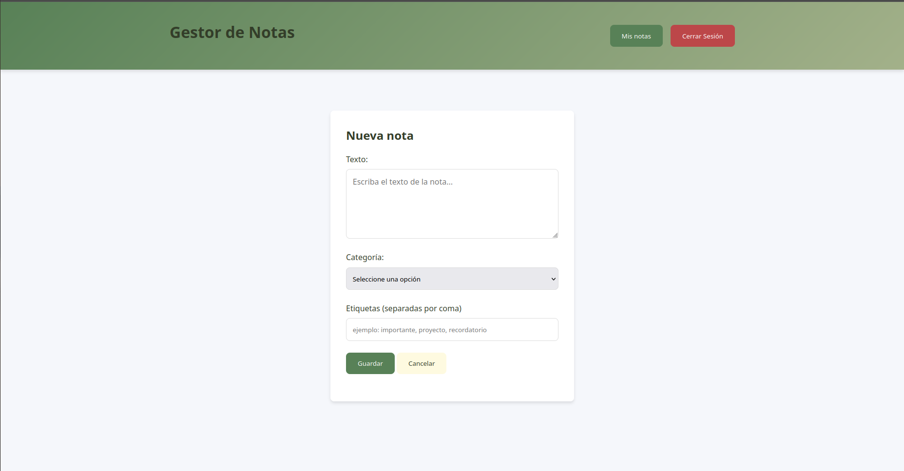
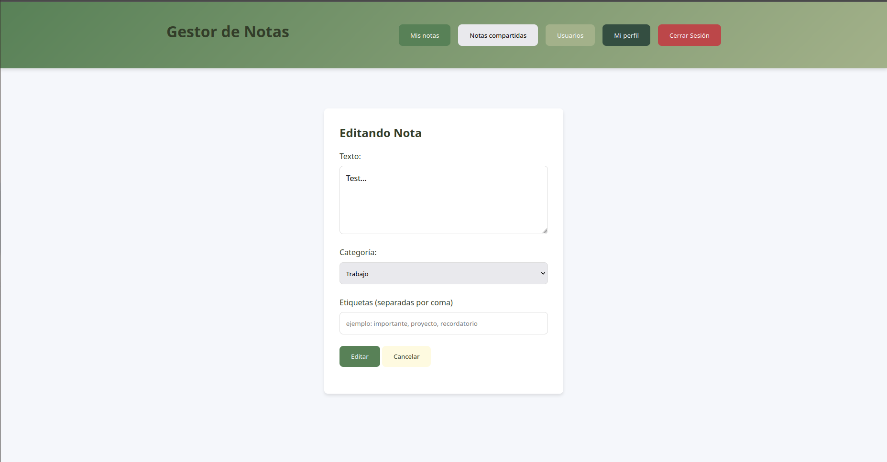
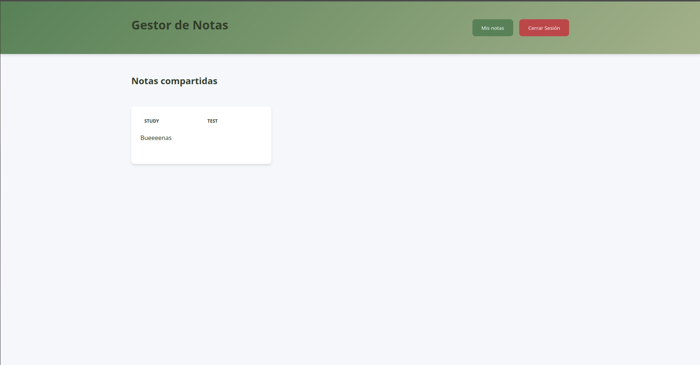
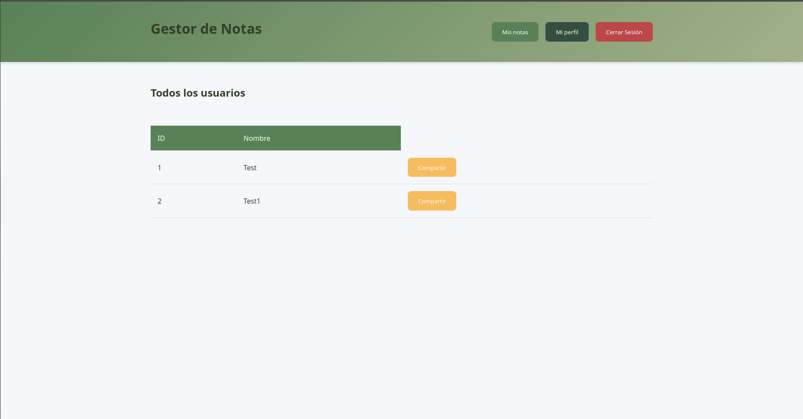
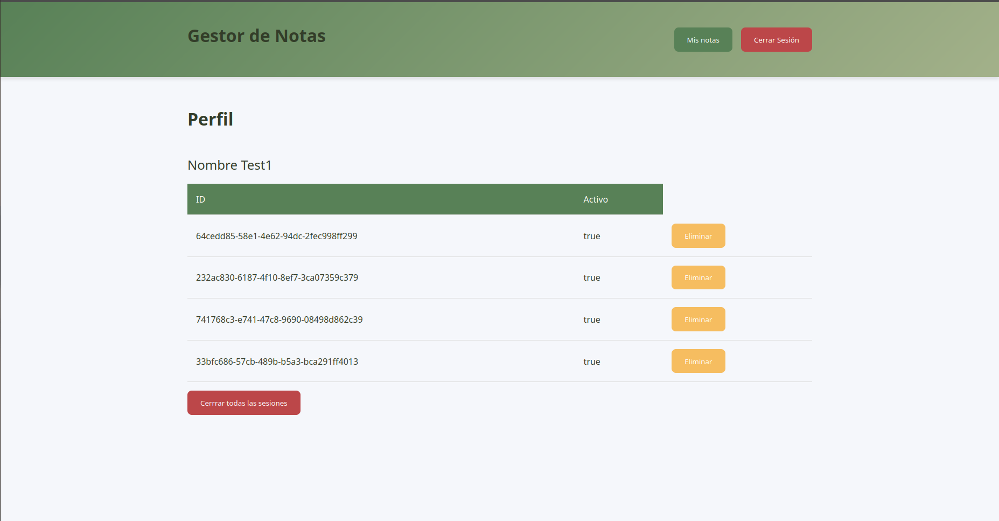

# 🖥️ Frontend - API Notes

Interfaz web para la API de notas. Permite a los usuarios registrarse, iniciar sesión y gestionar notas de manera sencilla.

## 🚀 Características
- Registro e inicio de sesión de usuarios.
- Crear, listar, editar y eliminar notas.
- Asignar categorías y etiquetas.
- Compartir notas con otros usuarios.
- Perfil de usuario y gestión de sesiones activas.

## 🛠️ Tecnologías utilizadas
- HTML5
- CSS3
- JavaScript (Vanilla)

## 📦 Instalación y uso

### 1. Clonar el repositorio
```bash
git clone https://github.com/SrStamm/Front-API-Notes.git
cd Front-API-Notes
```

### 2. Configuración
El frontend se conecta a la API en `http://localhost:8000` por defecto.
Si tu backend está en otra URL, edita el archivo `script.js` y cambia la constante `API_BASE_URL`.

### 3. Ejecutar

Abre el archivo `index.html` en tu navegador o usa una extensión como Live Server en VS Code.

## 🌐 Backend

Este proyecto depende de la API Notes:

👉 [API-Notes](https://github.com/SrStamm/API-Notes)

## 📸 Capturas
```markdown













```
